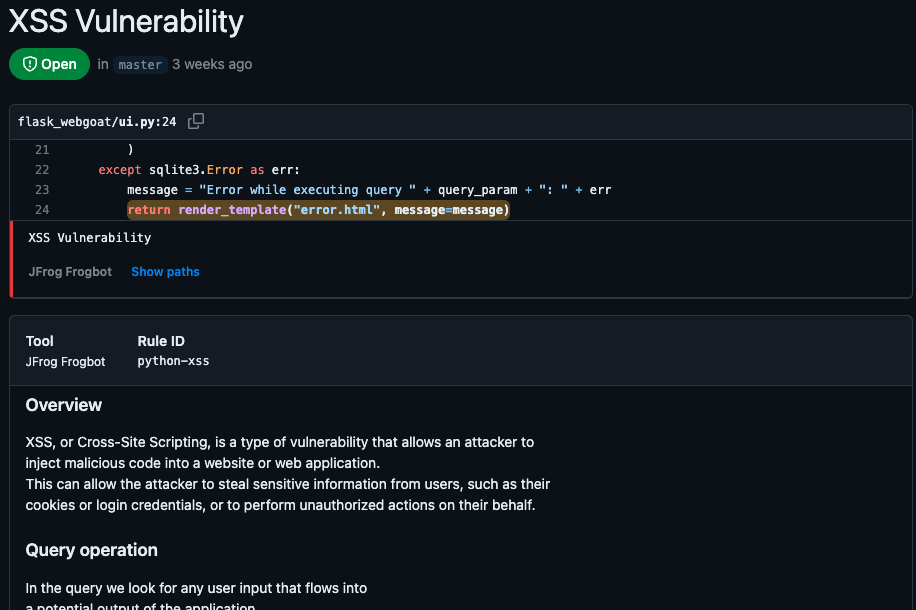
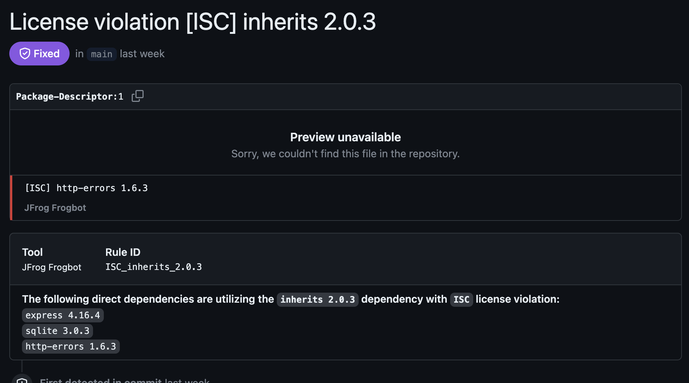

# Scan Repositories

#### Automatic pull requests creation

Frogbot scans your Git repositories periodically and automatically creates pull requests for upgrading vulnerable dependencies to a version with a fix.
  
  

#### Adding Security Alerts

For GitHub repositories, issues that are found during Frogbot's periodic scans are also added to the [Security Alerts](https://docs.github.com/en/code-security/code-scanning/automatically-scanning-your-code-for-vulnerabilities-and-errors/managing-code-scanning-alerts-for-your-repository) view in the UI. 

The following alert types are supported:

**1. CVEs on vulnerable dependencies**

**2. Secrets that are exposed in the code**

**3. Infrastructure as Code (Iac) issues on Terraform packages**

**4. Static Application Security Testing (Sast) vulnerabilities**

**5. Validate Dependency Licenses**

