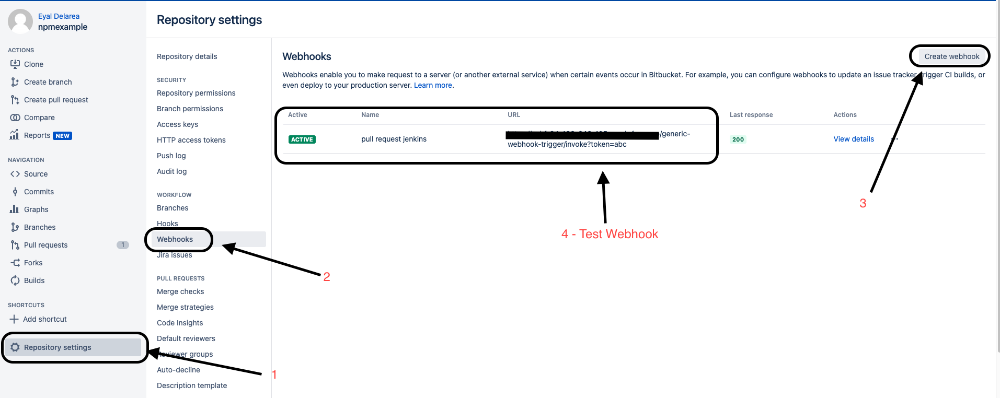
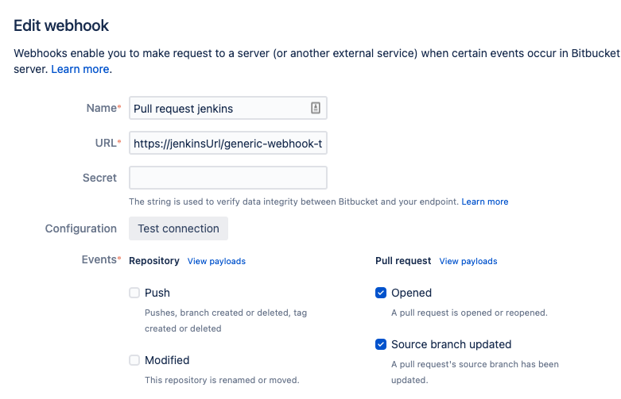
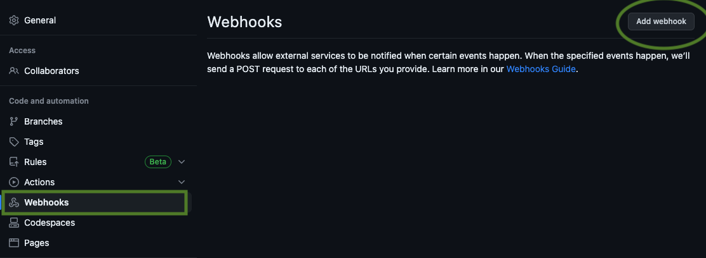
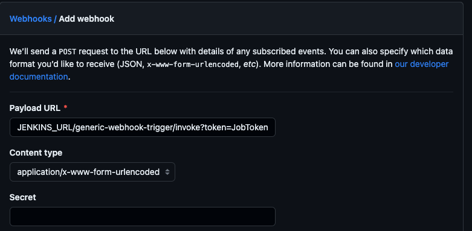

# Set up Frogbot Using Jenkins

**Important Notice**: For Scanning Pull Requests, it is advisable to refrain from setting up Frogbot using Jenkins for open source projects. For further details, please refer to the [👮 Security Note for Pull Requests Scanning](./scan-pull-requests.md#security-note-for-pull-requests-scanning).

#### 🖥️ Follow these steps to install Frogbot on Jenkins

<details>

<summary>1️⃣ Install the 'Generic Webhook Trigger' plugin in Jenkins</summary>

* From your Jenkins dashboard navigate to **Manage Jenkins** | **Manage Plugins** and then select the **Available** tab. 

* Use the search bar to find the **Generic Webhook Trigger** plugin and install it. [Read more about the plugin](https://plugins.jenkins.io/generic-webhook-trigger/).

</details>

***

<details>

<summary>2️⃣ Set the webhook from Git to Jenkins</summary>

**Bitbucket Server**

* Go to repository settings, select Webhooks, and create a new webhook.

  

* Set the webhook URL using the following pattern - `https://[your-jenkins-domain]/generic-webhook-trigger/invoke`

  

**GitHub**

* Go to repository settings and create a new webhook:

  

* Set the webhook URL using the following pattern - `https://[your-jenkins-domain]/generic-webhook-trigger/invoke`

  

**Azure Repos**

* The webhook URL pattern is `https://[your-jenkins-domain]/generic-webhook-trigger/invoke`
* Use [this](https://learn.microsoft.com/en-us/azure/devops/service-hooks/services/jenkins?view=azure-devops) article to setup the webhook.

**GitLab**

* Go to your **Project Settings** and select **Webhooks**.
* Set the webhook URL using the following pattern - `https://[your-jenkins-domain]/generic-webhook-trigger/invoke`
* Enable the **Merge request events** option.

  

</details>

***

<details>

<summary>3️⃣ Optional - setting JobToken to specify which Jenkins jobs to trigger</summary>

* In certain scenarios, the 'Generic Webhook Trigger' plugin might already be activated in other Jenkins jobs, and you may wish to prevent those jobs from being triggered by the Git Webhook you've configured for Frogbot. This can be accomplished by generating a dedicated API token for Frogbot within your Git Provider and then incorporating this token into the Webhook URL. The Webhook URL will then adhere to the following format - `https://[your-jenkins-domain]/generic-webhook-trigger/invoke?token=[your token]`. For further information on triggering only specific jobs in Jenkins, please refer to the [official documentation](https://plugins.jenkins.io/generic-webhook-trigger/#plugin-content-trigger-only-specific-job).

</details>

***

<details>

<summary>4️⃣ Set up credentials</summary>

* Configure the Git and JFrog connection parameters by utilizing the [Jenkins credentials](https://www.jenkins.io/doc/book/using/using-credentials/) feature, specifying them as **Secret Text**:

- **JF_URL**: This should be your JFrog Platform URL (e.g., "https://acme.jfrog.io").
- **JF_ACCESS_TOKEN** or **JF_USER** & **JF_PASSWORD**: Provide your JFrog Platform credentials.
- **JF_GIT_TOKEN**: A Git access token with both read and write permissions.

</details>

***

<details>

<summary>5️⃣ Prepare Jenkins Agent</summary>

* Ensure that the Jenkins agent has the necessary package managers installed. For example, if the project utilizes npm, it is crucial to have the npm client installed on the agent.

</details>

***

<details>

<summary>6️⃣ Setup pull requests scanning</summary>

* Create a new Pipeline Job in Jenkins.

  

* Enable the ‘Generic Webhook Trigger’ in the job

  

* Use the following template to create the pipeline script for the job

  ```yml
  pipeline {

      agent any // Use your agent here with installed package manager (npm,go,python etc..)

      triggers {
          GenericTrigger(
                  genericVariables: [
                          // GitHub
                          //[key: 'JF_GIT_REPO', value: '$.repository.name'],
                          //[key: 'JF_GIT_PULL_REQUEST_ID', value: '$.number'],
                          //[key: 'JF_GIT_OWNER', value: '$.pull_request.user.login'],
                          //[key: 'TRIGGER_KEY', value: '$.action'],

                          // Bitbucket Server
                          //[key: 'JF_GIT_REPO', value: '$.pullRequest.fromRef.repository.slug'],
                          //[key: 'JF_GIT_PULL_REQUEST_ID', value: '$.pullRequest.id'],
                          //[key: 'JF_GIT_OWNER', value: '$.pullRequest.fromRef.repository.project.key'],
                          //[key: 'TRIGGER_KEY', value: '$.eventKey'],

                          // GitLab
                          //[key: 'JF_GIT_REPO', value: '$.project.name'],
                          //[key: 'JF_GIT_PULL_REQUEST_ID', value: '$.pullRequestId'],
                          //[key: 'JF_GIT_OWNER', value: '$.user.username'],
                          //[key: 'TRIGGER_KEY', value: '$.event_type'],

                          // Azure Repos
                          //[key: 'JF_GIT_REPO', value: '$.resource.repository.name'],
                          //[key: 'JF_GIT_PULL_REQUEST_ID', value: '$.object_attributes.iid'],
                          //[key: 'JF_GIT_OWNER', value: '$.resource.repository.project.name'],
                          //[key: 'TRIGGER_KEY', value: '$.eventType'],
                  ],
                  causeString: 'Pull Request Trigger',
                  printContributedVariables: false,
                  // Use the token parameter to have different tokens for different jobs.
                  // Using only the token means only jobs with that exact token will be visible for that request
                  // This token will be sent as a query param from the webhook
                  // Example: https://jenkinsUrl/generic-webhook-trigger/invoke?token=MyJobToken
                  token: 'MyJobToken'
          )
      }

      environment {
          // [Mandatory]
          // Name of the git provider, one of the following: [bitbucketServer,github,gitlab,azureRepos]
          JF_GIT_PROVIDER = "CHOOSE_ONE_OF_THE_FOLLOWING"
          // [Mandatory]
          // JFrog platform URL (This functionality requires version 3.29.0 or above of Xray)
          JF_URL = credentials("JF_URL")

          // [Mandatory if JF_USER and JF_PASSWORD are not provided]
          // JFrog access token with 'read' permissions for Xray
          JF_ACCESS_TOKEN = credentials("JF_ACCESS_TOKEN")

          // [Mandatory]
          // GitHub enterprise server access token with the following permissions:
          // Read and Write access to code, pull requests, security events, and workflows
          JF_GIT_TOKEN = credentials("JF_GIT_TOKEN")

          // [Mandatory for on-premise]
          // API endpoint to VCS provider REST API
          // JF_GIT_API_ENDPOINT= ""

          // [Optional]
          // If the machine that runs Frogbot has no access to the internet, set the name of a remote repository
          // in Artifactory, which proxies https://releases.jfrog.io
          // The 'frogbot' executable and other tools it needs will be downloaded through this repository.
          // JF_RELEASES_REPO= ""

          // [Optional]
          // Configure the SMTP server to enable Frogbot to send emails with detected secrets in pull request scans.
          // SMTP server URL including should the relevant port: (Example: smtp.server.com:8080)
          // JF_SMTP_SERVER= ""

          // [Mandatory if JF_SMTP_SERVER is set]
          // The username required for authenticating with the SMTP server.
          // JF_SMTP_USER= ""

          // [Mandatory if JF_SMTP_SERVER is set]
          // The password associated with the username required for authentication with the SMTP server.
          // JF_SMTP_PASSWORD= ""

          // [Optional]
          // Avoid adding extra info to pull request comments. that isn't related to the scan findings.
          // JF_AVOID_EXTRA_MESSAGES= "TRUE"

          ///////////////////////////////////////////////////////////////////////////
          //   If your project uses a 'frogbot-config.yml' file, you should define //
          //   the following variables inside the file, instead of here.           //
          ///////////////////////////////////////////////////////////////////////////

          // [Mandatory if the two conditions below are met]
          // 1. The project uses yarn 2, NuGet or .NET to download its dependencies
          // 2. The `installCommand` variable isn't set in your frogbot-config.yml file.
          //
          // The command that installs the project dependencies (e.g "nuget restore")
          // JF_INSTALL_DEPS_CMD= ""

          // [Optional, default: "."]
          // Relative path to the root of the project in the Git repository
          // JF_WORKING_DIR= path/to/project/dir

          // [Optional]
          // Xray Watches. Learn more about them here: https://www.jfrog.com/confluence/display/JFROG/Configuring+Xray+Watches
          // JF_WATCHES= <watch-1>,<watch-2>...<watch-n>

          // [Optional]
          // JFrog project. Learn more about it here: https://www.jfrog.com/confluence/display/JFROG/Projects
          // JF_PROJECT= <project-key>

          // [Optional, default: "FALSE"]
          // Displays all existing vulnerabilities, including the ones that were added by the pull request.
          // JF_INCLUDE_ALL_VULNERABILITIES= "TRUE"

          // [Optional, default: "FALSE"]
          // When adding new comments on pull requests, keep old comments that were added by previous scans.
          // JF_AVOID_PREVIOUS_PR_COMMENTS_DELETION= "TRUE"

          // [Optional, default: "TRUE"]
          // Fails the Frogbot task if any security issue is found.
          // JF_FAIL= "FALSE"

          // [Optional, default: "TRUE"]
          // Relative path to a Pip requirements.txt file. If not set, the Python project's dependencies are determined and scanned using the project setup.py file.
          // JF_REQUIREMENTS_FILE= ""

          // [Optional, Default: "TRUE"]
          // Use Gradle wrapper.
          // JF_USE_WRAPPER= "FALSE"

          // [Optional]
          // Frogbot will download the project dependencies if they're not cached locally. To download the
          // dependencies from a virtual repository in JFrog Artifactory set the name of the repository. There's no
          // need to set this value, if it is set in the frogbot-config.yml file.
          // JF_DEPS_REPO= ""

          // [Optional]
          // Template for the branch name generated by Frogbot when creating pull requests with fixes.
          // The template must include {BRANCH_NAME_HASH}, to ensure that the generated branch name is unique.
          // The template can optionally include the {IMPACTED_PACKAGE} and {FIX_VERSION} variables.
          // JF_BRANCH_NAME_TEMPLATE= "frogbot-{IMPACTED_PACKAGE}-{BRANCH_NAME_HASH}"

          // [Optional]
          // Template for the commit message generated by Frogbot when creating pull requests with fixes
          // The template can optionally include the {IMPACTED_PACKAGE} and {FIX_VERSION} variables.
          // JF_COMMIT_MESSAGE_TEMPLATE= "Upgrade {IMPACTED_PACKAGE} to {FIX_VERSION}"

          // [Optional]
          // Template for the pull request title generated by Frogbot when creating pull requests with fixes.
          // The template can optionally include the {IMPACTED_PACKAGE} and {FIX_VERSION} variables.
          // JF_PULL_REQUEST_TITLE_TEMPLATE= "[🐸 Frogbot] Upgrade {IMPACTED_PACKAGE} to to {FIX_VERSION}"

          // [Optional, Default: "FALSE"]
          // If TRUE, Frogbot creates a single pull request with all the fixes.
          // If FALSE, Frogbot creates a separate pull request for each fix.
          // JF_GIT_AGGREGATE_FIXES= "FALSE"

          // [Optional, Default: "FALSE"]
          // Handle vulnerabilities with fix versions only
          // JF_FIXABLE_ONLY= "TRUE"

          // [Optional]
          // Set the minimum severity for vulnerabilities that should be fixed and commented on in pull requests
          // The following values are accepted: Low, Medium, High or Critical
          // JF_MIN_SEVERITY= ""

          // [Optional, Default: eco-system+frogbot@jfrog.com]
          // Set the email of the commit author
          // JF_GIT_EMAIL_AUTHOR= ""

          // [Optional]
          // List of comma separated email addresses to receive email notifications about secrets
          // detected during pull request scanning. The notification is also sent to the email set
          // in the committer git profile regardless of whether this variable is set or not.
          // JF_EMAIL_RECEIVERS= ""

          // [Optional]
          // Add a title to pull request comments generated by Frogbot.
          // JF_PR_COMMENT_TITLE= ""
      }

      stages {

          stage("Verify trigger") {
              steps {
                  script {
                      // Change this to your trigger name
                      // GitHub: synchronize
                      // BitbucketServer: pr:from_ref_updated && pr:opened payload
                      // GitLab: merge_request
                      // AzureRepos: git.pullrequest.updated || git.pullrequest.created
                      if (env.TRIGGER_KEY != 'synchronize') {
                          error('Event key is not pr:from_ref_updated. Aborting pipeline execution.')
                      }
                  }
              }
          }

          stage('Download Frogbot') {
              steps {
                  script{
                            if (env.JF_RELEASES_REPO == "") {
                              // For Linux / MacOS runner:
                              sh """ curl -fLg "https://releases.jfrog.io/artifactory/frogbot/v2/[RELEASE]/getFrogbot.sh" | sh"""
                              // For Windows runner:
                              // powershell """iwr https://releases.jfrog.io/artifactory/frogbot/v2/[RELEASE]/frogbot-windows-amd64/frogbot.exe -OutFile .\frogbot.exe"""
                          } else {
                              // For Linux / MacOS air-gaped environments:
                              sh 'curl -fLg "$env.JF_URL/artifactory/$env.JF_RELEASES_REPO/artifactory/frogbot/v2/[RELEASE]/getFrogbot.sh" | sh'
                              // For Windows air-gaped environments:
                              // powershell """iwr ${env.JF_URL}/artifactory/${env.JF_RELEASES_REPO}/artifactory/frogbot/v2/[RELEASE]/frogbot-windows-amd64/frogbot.exe -OutFile .\frogbot.exe"""
                          }
                  }
              }
          }

          stage('Scan Pull Request') {
              steps {
                  sh "./frogbot scan-pull-request"
              }
          }
      }
  }
  ```

</details>

***

<details>

<summary>7️⃣ Setup repository scanning</summary>

* Create a new Pipeline Job in Jenkins.

  

* Use the following template for pipeline.

  ```yml
  // Run the job once a day
  CRON_SETTINGS = '''0 0 * * *'''

  pipeline {
      agent any

      triggers {
          cron(CRON_SETTINGS)
      }

      environment {

          // [Mandatory]
          // Username of the account associated with the Git access token
          JF_GIT_USERNAME = ""

          // [Mandatory]
          // Owner of the repository
          // BitbucketServer note: Private projects should start with the prefix: "~"
          JF_GIT_OWNER = ""

          // [Mandatory]
          // Name of the repository to scan
          JF_GIT_REPO = ""

          // [Mandatory]
          // Name of the git provider, one of the following: [bitbucketServer,github,gitlab,azureRepos]
          JF_GIT_PROVIDER = "CHOOSE_ONE_OF_THE_FOLLOWING"

          // [Mandatory]
          // JFrog platform URL (This functionality requires version 3.29.0 or above of Xray)
          JF_URL = credentials("JF_URL")

          // [Mandatory if JF_USER and JF_PASSWORD are not provided]
          // JFrog access token with 'read' permissions for Xray
          JF_ACCESS_TOKEN = credentials("JF_ACCESS_TOKEN")

          // [Mandatory]
          // GitHub enterprise server access token with the following permissions:
          // Read and Write access to code, pull requests, security events, and workflows
          JF_GIT_TOKEN = credentials("JF_GIT_TOKEN")

          // [Mandatory for on-premise]
          // API endpoint to VCS provider REST API
          // JF_GIT_API_ENDPOINT= ""

          // [Optional]
          // If the machine that runs Frogbot has no access to the internet, set the name of a remote repository
          // in Artifactory, which proxies https://releases.jfrog.io
          // The 'frogbot' executable and other tools it needs will be downloaded through this repository.
          // JF_RELEASES_REPO= ""

          // [Optional]
          // Avoid adding extra info to pull request comments. that isn't related to the scan findings.
          // JF_AVOID_EXTRA_MESSAGES= "TRUE"

          ///////////////////////////////////////////////////////////////////////////
          //   If your project uses a 'frogbot-config.yml' file, you should define //
          //   the following variables inside the file, instead of here.           //
          ///////////////////////////////////////////////////////////////////////////

          // [Mandatory if the two conditions below are met]
          // 1. The project uses yarn 2, NuGet or .NET to download its dependencies
          // 2. The `installCommand` variable isn't set in your frogbot-config.yml file.
          //
          // The command that installs the project dependencies (e.g "nuget restore")
          // JF_INSTALL_DEPS_CMD= ""

          // [Optional, default: "."]
          // Relative path to the root of the project in the Git repository
          // JF_WORKING_DIR= path/to/project/dir

          // [Optional]
          // Xray Watches. Learn more about them here: https://www.jfrog.com/confluence/display/JFROG/Configuring+Xray+Watches
          // JF_WATCHES= <watch-1>,<watch-2>...<watch-n>

          // [Optional]
          // JFrog project. Learn more about it here: https://www.jfrog.com/confluence/display/JFROG/Projects
          // JF_PROJECT= <project-key>

          // [Optional, default: "FALSE"]
          // Displays all existing vulnerabilities, including the ones that were added by the pull request.
          // JF_INCLUDE_ALL_VULNERABILITIES= "TRUE"

          // [Optional, default: "TRUE"]
          // Fails the Frogbot task if any security issue is found.
          // JF_FAIL= "FALSE"

          // [Optional, default: "TRUE"]
          // Relative path to a Pip requirements.txt file. If not set, the Python project's dependencies are determined and scanned using the project setup.py file.
          // JF_REQUIREMENTS_FILE= ""

          // [Optional, Default: "TRUE"]
          // Use Gradle wrapper.
          // JF_USE_WRAPPER= "FALSE"

          // [Optional]
          // Frogbot will download the project dependencies if they're not cached locally. To download the
          // dependencies from a virtual repository in JFrog Artifactory set the name of the repository. There's no
          // need to set this value, if it is set in the frogbot-config.yml file.
          // JF_DEPS_REPO= ""

          // [Optional]
          // Template for the branch name generated by Frogbot when creating pull requests with fixes.
          // The template must include {BRANCH_NAME_HASH}, to ensure that the generated branch name is unique.
          // The template can optionally include the {IMPACTED_PACKAGE} and {FIX_VERSION} variables.
          // JF_BRANCH_NAME_TEMPLATE= "frogbot-{IMPACTED_PACKAGE}-{BRANCH_NAME_HASH}"

          // [Optional]
          // Template for the commit message generated by Frogbot when creating pull requests with fixes
          // The template can optionally include the {IMPACTED_PACKAGE} and {FIX_VERSION} variables.
          // JF_COMMIT_MESSAGE_TEMPLATE= "Upgrade {IMPACTED_PACKAGE} to {FIX_VERSION}"

          // [Optional]
          // Template for the pull request title generated by Frogbot when creating pull requests with fixes.
          // The template can optionally include the {IMPACTED_PACKAGE} and {FIX_VERSION} variables.
          // JF_PULL_REQUEST_TITLE_TEMPLATE= "[🐸 Frogbot] Upgrade {IMPACTED_PACKAGE} to to {FIX_VERSION}"

          // [Optional, Default: "FALSE"]
          // If TRUE, Frogbot creates a single pull request with all the fixes.
          // If FALSE, Frogbot creates a separate pull request for each fix.
          // JF_GIT_AGGREGATE_FIXES= "FALSE"

          // [Optional, Default: "FALSE"]
          // Handle vulnerabilities with fix versions only
          // JF_FIXABLE_ONLY= "TRUE"

          // [Optional]
          // Set the minimum severity for vulnerabilities that should be fixed and commented on in pull requests
          // The following values are accepted: Low, Medium, High, or Critical
          // JF_MIN_SEVERITY= ""

          // [Optional, Default: eco-system+frogbot@jfrog.com]
          // Set the email of the commit author
          // JF_GIT_EMAIL_AUTHOR: ""
      }

      stages {

          stage('Download Frogbot') {
              steps {
                  script{
                          if (env.JF_RELEASES_REPO == "") {
                              // For Linux / MacOS runner:
                              sh """ curl -fLg "https://releases.jfrog.io/artifactory/frogbot/v2/[RELEASE]/getFrogbot.sh" | sh"""
                              // For Windows runner:
                              // powershell """iwr https://releases.jfrog.io/artifactory/frogbot/v2/[RELEASE]/frogbot-windows-amd64/frogbot.exe -OutFile .\frogbot.exe"""
                          } else {
                              // For Linux / MacOS air gaped environments:
                              sh 'curl -fLg "$env.JF_URL/artifactory/$env.JF_RELEASES_REPO/artifactory/frogbot/v2/[RELEASE]/getFrogbot.sh" | sh'
                              // For Windows air gaped environments:
                              // powershell """iwr ${env.JF_URL}/artifactory/${env.JF_RELEASES_REPO}/artifactory/frogbot/v2/[RELEASE]/frogbot-windows-amd64/frogbot.exe -OutFile .\frogbot.exe"""
                          }
                  }
              }
          }

          stage('Scan Repository') {
              steps {
                  sh "./frogbot scan-repository"
              }
          }
      }
  }
  ```

</details>
