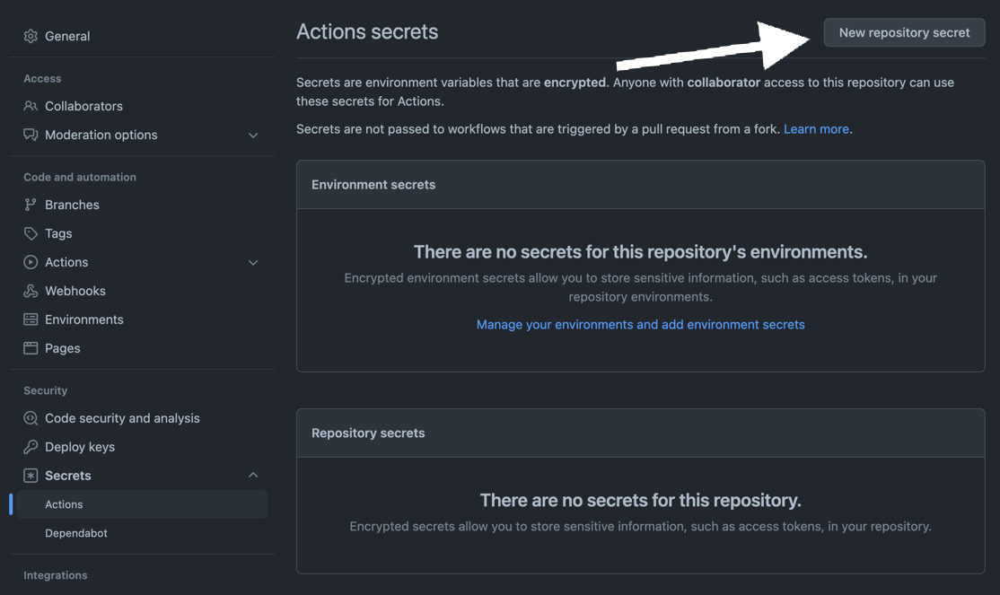
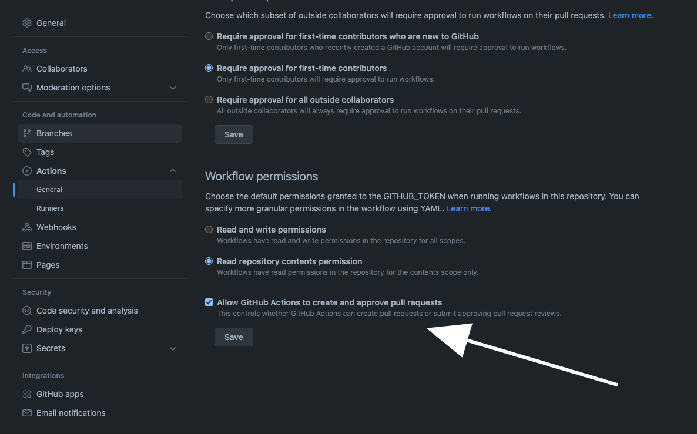
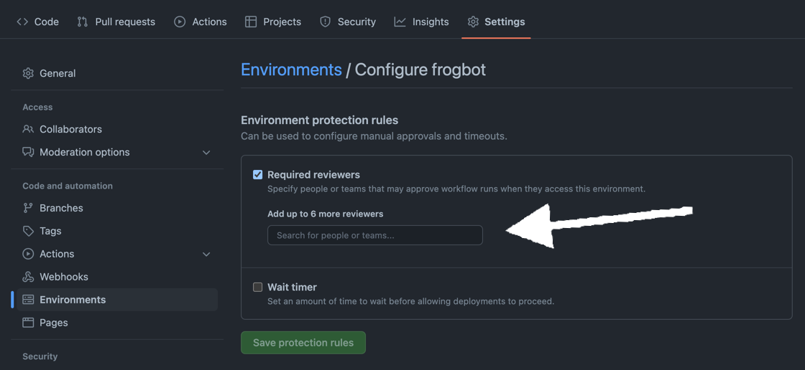
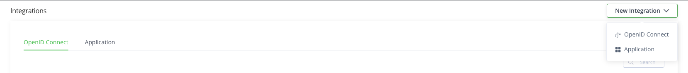
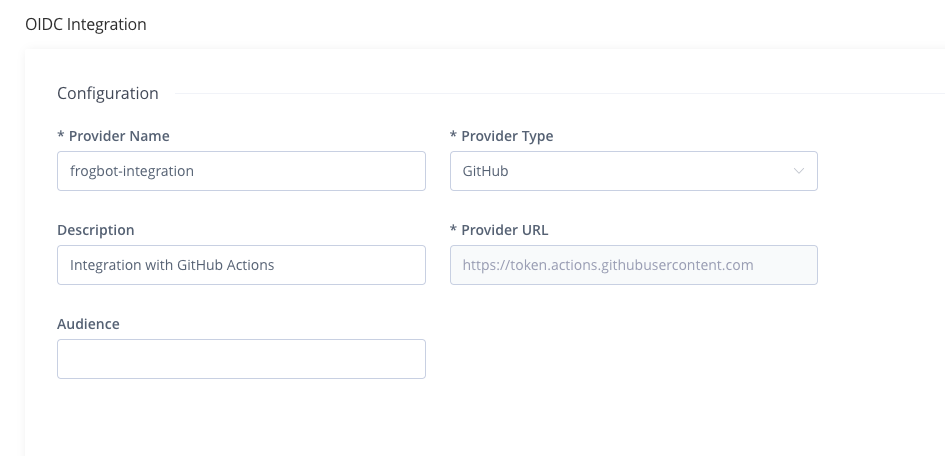
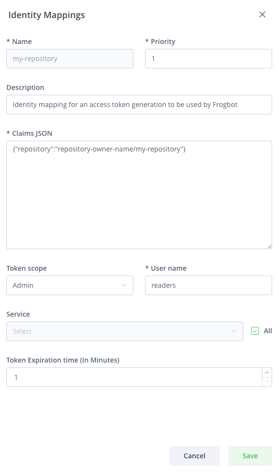

# Setup Frogbot Using GitHub Actions

### Github Prerequisites

* Go to your repository's **settings** tab and save the JFrog connection details as repository secrets with the following names:
  * **JF\_URL** (JFrog Platform URL - Example: `https://acme.jfrog.io`)
  > You can also use **JF\_XRAY\_URL** and **JF\_ARTIFACTORY\_URL** instead of **JF\_URL**
  * **JF\_ACCESS\_TOKEN** (JFrog access token)
  > You can also use **JF\_USER** + **JF\_PASSWORD** instead of **JF\_ACCESS\_TOKEN**.
  >
  > 
  > Instead of using **JF\_ACCESS\_TOKEN** and providing an access token as a GitHub secret, you can utilize the GitHub [OpenID Connect (OIDC)](#connecting-using-openid-connect-oidc) authentication protocol.
  * **JF\_GIT\_TOKEN** (GitHub token)
  > You can utilize [${{secrets.GITHUB_TOKEN}}](https://docs.github.com/en/actions/security-guides/automatic-token-authentication) for **JF_GIT_TOKEN**, which is an automatically generated token by GitHub.
  > However, this option comes with a limitation: a workflow, such as Frogbot itself, cannot trigger another workflow. Consequently, if you have additional workflows intended to activate upon the creation of a new pull request, they might not be initiated.
  > To resolve this issue, you can generate a [personal access token](https://docs.github.com/en/authentication/keeping-your-account-and-data-secure/managing-your-personal-access-tokens) and use it as JF_GIT_TOKEN.
  




* Under **Actions** > **General**, check the **Allow GitHub Actions to create and approve pull requests** check box.



* For open-source projects: Create a new [GitHub environment](https://docs.github.com/en/actions/deployment/targeting-different-environments/using-environments-for-deployment#creating-an-environment) called **frogbot** and add people or public teams as reviewers. The chosen reviewers can trigger Frogbot scans on pull requests.



### Frogbot GitHub Action Templates

1. Begin by cloning the GitHub repository to your local environment.

2. Switch to the target branch where you'd like the pull requests to be scanned.

3. Create a file named **frogbot-scan-pull-request.yml**. Fill it with the provided [template](templates/github-actions/frogbot-scan-pull-request.yml), and then push it into the **.github/workflows** directory at the root of your GitHub repository.

4. Return to the default branch.

5. Now, create a file named **frogbot-scan-repository.yml**. Again, populate it with the provided [template](templates/github-actions/frogbot-scan-repository.yml) and push it into the **.github/workflows** directory at the root of your GitHub repository.

<br>
<a id="connecting-using-openid-connect-oidc"></a>
<details>
<summary><big><b>Authenticating using OpenID Connect (OIDC)</b></big></summary>

#### General

The sensitive connection details, such as the access token used by JFrog Frogbot, can be automatically generated by the action instead of storing it as a secret in GitHub.
This is made possible by leveraging the OpenID-Connect (OIDC) protocol. This protocol can authenticate the workflow issuer and supply a valid access token. Learn more about this integration in [this](https://jfrog.com/blog/secure-access-development-jfrog-github-oidc) blog post.
To utilize the OIDC protocol, follow these steps:

#### JFrog Platform configuration

1. **Configure an OIDC Integration**: This phase sets an integration between GitHub Actions to the JFrog platform.<br>
  A) Navigate to the Administration tab In the JFrog Platform UI<br>
  B) Click `General` | `Manage Integrations`<br>
  C) Click `New Integration` | `OpenID Connect`:<br>
     
  D) Configure the OIDC integration:<br>
     

| NOTE:                                                                                                                                                                                                                                      |
|--------------------------------------------------------------------------------------------------------------------------------------------------------------------------------------------------------------------------------------------|
| The value specified as the 'Provider Name' should be used as the 'oidc-provider-name' input in [Workflow configuration step 2](#workflowstep2) below.                                                                                      |
| The 'Audience' field does NOT represent the 'aud' claim that can be added into identity-mapping configured in the 'Claims JSON' (shown below). Only claims that are included in the 'Claims Json' created during step 2 will be validated. |

<div id="platformstep2"/>

2.  **Configure an identity mapping**: This phase sets an integration between a particular GitHub repository to the JFrog platform.

    An identity mapping is a configuration object utilized by the JFrog Platform to associate incoming OIDC claims with particular selected fields. These fields might include `repository`, `actor`, `workflow`, and others.
    To configure the identity mapping, click on the identity mapping created in section 1 and then click on `Add Identity Mapping`. Fill in priority 1 and fill out all required fields:<br>
    

    You have the flexibility to define any valid list of claims required for request authentication. You can check a list of the possible claims [here](https://docs.github.com/en/actions/deployment/security-hardening-your-deployments/about-security-hardening-with-openid-connect#understanding-the-oidc-token).
    Example Claims JSON:

    ```json
    {
        "repository": "repository-owner/my-repository"
    }
    ```

### Workflow configuration

1.  **Set required permissions**: In the course of the protocol's execution, it's imperative to acquire a JSON Web Token (JWT) from GitHub's OIDC provider. To request this token, it's essential to configure the specified permission in the workflow file:

    ```yml
    permissions:
        id-token: write
    ```

    <div id="workflowstep2"/>

2.  **Pass the 'oidc-provider-name' input to the Action (Required)**: The 'oidc-provider-name' parameter designates the OIDC configuration whose one of its identity mapping should align with the generated JWT claims. This input needs to align with the 'Provider Name' value established within the OIDC configuration in the JFrog Platform.
3.  **Pass the 'oidc-audience' input to the Action (Optional)**: The 'oidc-audience' input defines the intended recipients of an ID token (JWT), ensuring access is restricted to authorized recipients for the JFrog Platform. By default, it contains the URL of the GitHub repository owner. It enforces a condition, allowing only workflows within the designated repository/organization to request an access token. Read more about it [here](https://docs.github.com/en/actions/deployment/security-hardening-your-deployments/about-security-hardening-with-openid-connect#customizing-the-audience-value).

Example step utilizing OpenID Connect:

```yml
- uses: jfrog/frogbot@v2
  env:
      JF_URL: ${{ secrets.JF_URL }}
      JF_GIT_TOKEN: ${{ secrets.GITHUB_TOKEN }}
  with:
      oidc-provider-name: frogbot-integration
```
</details>