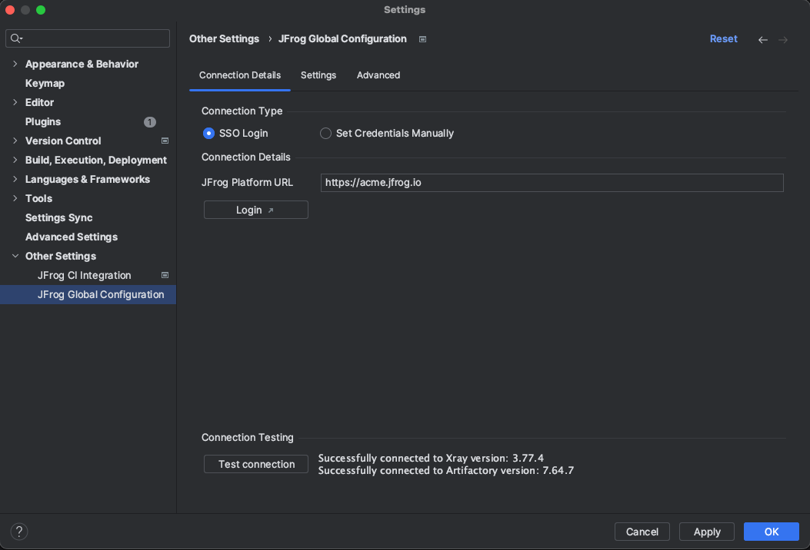

# Connect the JFrog Plugin to the JFrog Platform

<details>

<summary>Optionally set up a free JFrog Environment in the Cloud</summary>

Need a free JFrog environment in the Cloud, so that JFrog IntelliJ IDEA Plugin can connect to it? Just run one of the following commands in your terminal. The commands will do the following:

1. Install JFrog CLI on your machine.
2. Create a FREE JFrog environment in the Cloud for you.
3. Configure IntelliJ IDEA to connect to your new environment.

**MacOS and Linux using cURL**

```bash
curl -fL https://getcli.jfrog.io?setup | sh
```

**Windows using PowerShell**

```powershell
powershell "Start-Process -Wait -Verb RunAs powershell '-NoProfile iwr https://releases.jfrog.io/artifactory/jfrog-cli/v2-jf/[RELEASE]/jfrog-cli-windows-amd64/jf.exe -OutFile $env:SYSTEMROOT\system32\jf.exe'" ; jf setup
```

</details>

<details>

<summary>Connect the JFrog Plugin to an existing JFrog Environment</summary>

You can connect the plugin to your JFrog environment using one of the following methods:

**Using the IDE Settings**

Once the plugin is successfully installed, connect the plugin to your instance of the JFrog Platform:

1. If your JFrog Platform instance is behind an HTTP proxy, configure the proxy settings as described [here](https://www.jetbrains.com/help/idea/settings-http-proxy.html).
    Manual proxy configuration is supported since version 1.3.0 of the JFrog IntelliJ IDEA Plugin. Auto-detect proxy settings is supported since version 1.7.0.
2. Under **Settings (Preferences)** | **Other Settings**, click **JFrog Global Configuration**.
3. Set your JFrog Platform URL and login credentials.
4. Test your connection to Xray using the Test Connection button.
  


**Using Environment Variables**

The plugin also supports connecting to your JFrog environment using environment variables:

1. Under **Settings (Preferences)** | **Other Settings**, click **JFrog Global Configuration**.
2. Mark **Load connection details from environment variables**.

You may provide basic auth credentials or access token as follows:

> **_NOTE:_**  For security reasons, it is recommended to unset the environment variables after launching the IDE.

- `JFROG_IDE_PLATFORM_URL` - JFrog Platform URL
- `JFROG_IDE_USERNAME` - JFrog Platform username
- `JFROG_IDE_PASSWORD` - JFrog Platform password
- `JFROG_IDE_ACCESS_TOKEN` - JFrog Platform access token

</details>

> **NOTES:**
>
> * If your JFrog Platform instance uses a domain with a self-signed certificate, add the certificate to IDEA as described [here](https://www.jetbrains.com/help/idea/settings-tools-server-certificates.html).
> * From JFrog Xray version **1.9** to **2.x**, IntelliJ IDEA users connecting to Xray from IntelliJ are required to be granted the ‘View Components’ action in Xray.
> * From JFrog Xray version **3.x**, as part of the JFrog Platform, IntelliJ IDEA users connecting to Xray from IntelliJ require ‘Read’ permission. For more information, see [here](https://jfrog.com/help/r/jfrog-platform-administration-documentation/permissions).
