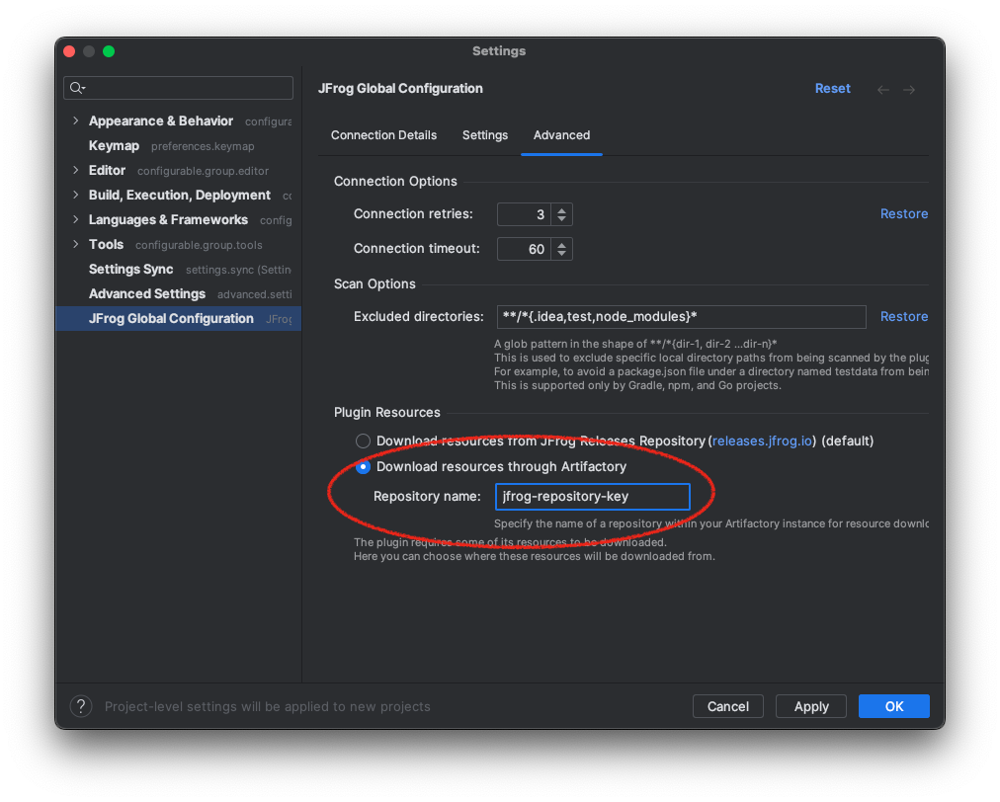

# Plugin Configuration

To access the plugin configuration, click on the gear icon:

## Advanced

#### Downloading External Resources Through Artifactory

The JFrog IDEA Plugin requires necessary resources for scanning your projects.
By default, the JFrog IDEA Plugin downloads the resources it requires from <https://releases.jfrog.io>. If the machine running IDEA has no access to it, follow these steps to allow the resources to be downloaded through an Artifactory instance, which the machine has access to:

1. Login to the JFrog Platform UI, with a user who has admin permissions.

2. Create a Remote Repository with the following properties set:
    - Under the 'Basic' tab:
        - Package Type: Generic
        - Repository Key: jfrog-releases-repository
        - URL: <https://releases.jfrog.io>

    

    - Under the 'Advanced' tab:
        - Uncheck the 'Store Artifacts Locally' option

    

3. Navigate to the Advanced tab within JFrog Global Configuration

4. Click on Download resources through Artifactory

5. Insert the Repository Key you created in the Repository key text field

