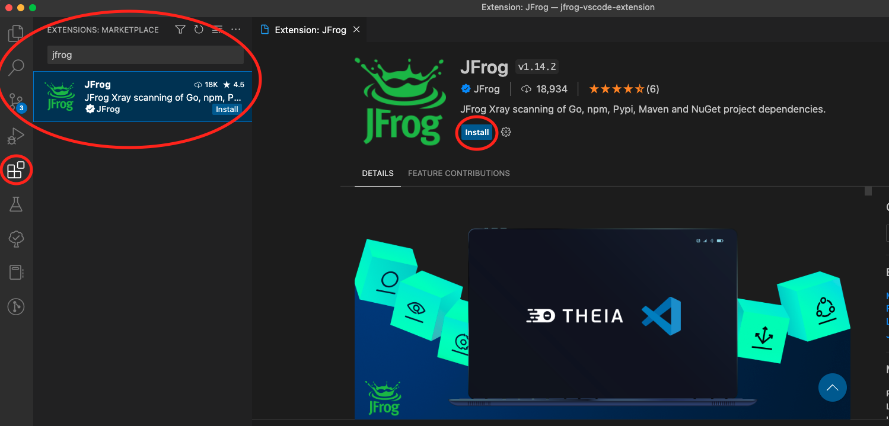

# Install Xray in VS Code

The extension is available to install from the VS Code extensions marketplace. After installing the JFrog extension tab will appear in the activity bar.&#x20;

<figure><figcaption></figcaption></figure>
