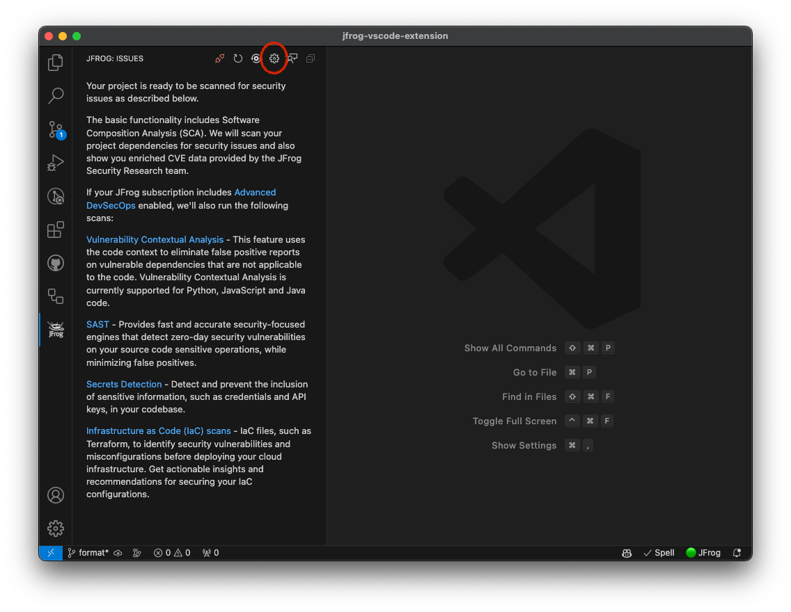
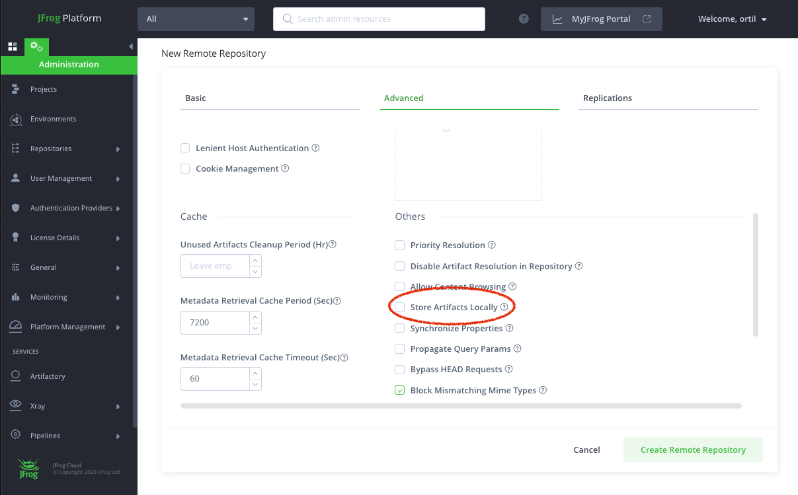

# Manage VS Code IDE

To access the extension settings, click on the gear icon:



#### Exclude Paths from Scan

By default, paths containing the words `.git`, `test`, `venv` and `node_modules` are excluded from Xray scan. The exclude pattern can be configured in the [Extension Settings](extension-settings.md).

#### Proxy Configuration

If your JFrog environment is behind an HTTP/S proxy, follow these steps to configure the proxy server:

1. Go to Preferences --> Settings --> Application --> Proxy
2. Set the proxy URL under `Proxy`.
3. Make sure 'Proxy Support' is `override` or `on`.

* Alternatively, you can use the HTTP\_PROXY and HTTPS\_PROXY environment variables.

#### Downloading External Resources Through Artifactory

JFrog VS Code extension requires necessary resources for scanning your projects. By default, the JFrog VS Code extension downloads the resources it requires from [https://releases.jfrog.io](https://releases.jfrog.io). If the machine running JFrog VS Code extension has no access to it, follow these steps to allow the resources to be downloaded through an Artifactory instance, which the machine has access to:

1. Login to the JFrog Platform UI, with a user who has admin permissions.
2.  Create a Remote Repository with the following properties set:

    * Under the `Basic` tab:
      * Package Type: Generic
      * Repository Key: jfrog-releases-repository
      * URL: [https://releases.jfrog.io](https://releases.jfrog.io)

    

    * Under the `Advanced` tab:
      * Uncheck the 'Store Artifacts Locally' option

    
3. Navigate to the Settings in JFrog VS Code Extension
4. Insert the Repository Key you created in the Repository key text field


Or set the `JFROG_IDE_RELEASES_REPO` environment variable with the Repository Key you created.

#### Proxy Authorization

If your proxy server requires credentials, follow these steps:

1. Follow 1-3 steps under [Proxy configuration](extension-settings/#proxy-configuration).

**Basic authorization**

1. Encode with base64: `[Username]:[Password]`.
2. Under 'Proxy Authorization' click on 'Edit in settings.json'.
3. Add to settings.json:

* `"http.proxyAuthorization": "Basic [Encoded credentials]"`.

**Access token authorization**

1. Under 'Proxy Authorization' click on 'Edit in settings.json'.
2. Add to settings.json:

* `"http.proxyAuthorization": "Bearer [Access token]"`.

**Example**

* `Username: foo`
* `Password: bar`

settings.json:

```
{
    "http.proxyAuthorization": "Basic Zm9vOmJhcg=="
}
```

## Xray Policies and Watches

You can configure the JFrog VS-Code extension to use the security policies you create in Xray. Policies enable you to create a set of rules, in which each rule defines security criteria, with a corresponding set of automatic actions according to your needs. Policies are enforced when applying them to Watches.

If you'd like to use a JFrog Project that is associated with the policy, follow these steps:

1. Create a [JFrog Project](https://www.jfrog.com/confluence/display/JFROG/Projects), or obtain the relevant JFrog Project key.
2. Create a [Policy](https://www.jfrog.com/confluence/display/JFROG/Creating+Xray+Policies+and+Rules) on JFrog Xray.
3. Create a [Watch](https://www.jfrog.com/confluence/display/JFROG/Configuring+Xray+Watches) on JFrog Xray and assign your Policy and Project as resources to it.
4. Configure your Project key in the [Extension Settings](extension-settings.md).

If however your policies are referenced through an Xray Watch or Watches, follow these steps instead:

1. Create one or more [Watches](https://www.jfrog.com/confluence/display/JFROG/Configuring+Xray+Watches) on JFrog Xray.
2. Configure your Watches in the [Extension Settings](extension-settings.md).

### Troubleshooting

Change the log level to `debug`, `info`, `warn`, or `err` in the [Extension Settings](extension-settings.md).
