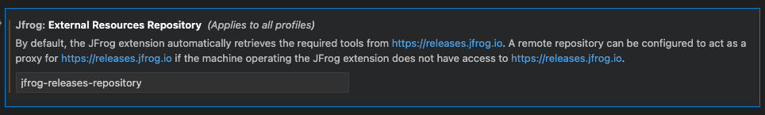

# Extension Settings

The extension is licensed under Apache License 2.0.

To open the extension settings, use the following VS Code menu command:

* On Windows/Linux - File > Preferences > Settings > Extensions > JFrog
* On macOS - Code > Preferences > Settings > Extensions > JFrog

#### Exclude Paths from Scan

By default, paths containing the words `test`, `venv` and `node_modules` are excluded from Xray scan. The exclude pattern can be configured in the [Extension Settings](extension-settings.md).

#### Proxy Configuration

If your JFrog environment is behind an HTTP/S proxy, follow these steps to configure the proxy server:

1. Go to Preferences --> Settings --> Application --> Proxy
2. Set the proxy URL under 'Proxy'.
3. Make sure 'Proxy Support' is 'override' or 'on'.

* Alternatively, you can use the HTTP\_PROXY and HTTPS\_PROXY environment variables.

#### Downloading External Resources Through Artifactory

JFrog VS Code extension required necessary resources for scanning vulnerabilities in your project.
By default, the JFrog extension downloads the necessary resources needed from https://releases.jfrog.io. If the machine that runs JFrog extension has no access to it, follow these steps to allow the tools to be downloaded from an Artifactory instance, which the machine has access to:

1. Login to the Artifactory UI, with a user who has admin credentials.

2. Create a Remote Repository with the following properties set:
    - Under the 'Basic' tab:
        Package Type: Generic
        URL: https://releases.jfrog.io
    - Under the 'Advanced' tab:
        Uncheck the 'Store Artifacts Locally' option
3. Open JFrog VS Code extension settings and add the Repository Key you created in the External Resources Repository section:

Or set the `JFROG_IDE_RELEASES_REPO` environment variable with the Repository Key you created.

#### Proxy Authorization

If your proxy server requires credentials, follow these steps:

1. Follow 1-3 steps under [Proxy configuration](extension-settings#proxy-configuration).

**Basic authorization**

1. Encode with base64: `[Username]:[Password]`.
2. Under 'Proxy Authorization' click on 'Edit in settings.json'.
3. Add to settings.json:

* `"http.proxyAuthorization": "Basic [Encoded credentials]"`.

**Access token authorization**

1. Under 'Proxy Authorization' click on 'Edit in settings.json'.
2. Add to settings.json:

* `"http.proxyAuthorization": "Bearer [Access token]"`.

**Example**

* `Username: foo`
* `Password: bar`

settings.json:

```
{
    "http.proxyAuthorization": "Basic Zm9vOmJhcg=="
}
```

### Troubleshooting

Change the log level to 'debug', 'info', 'warn', or 'err' in the [Extension Settings](extension-settings.md).
