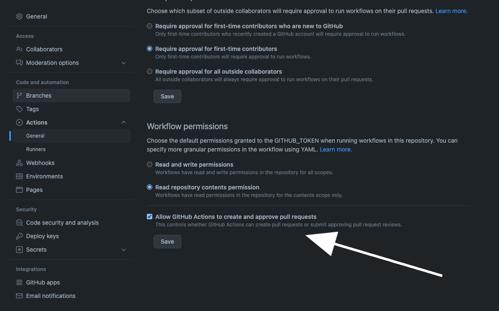

# Setting Frogbot on GitHub Repositories

### Github Prerequisites

* Go to your repository's **settings** tab and save the JFrog connection details as repository secrets with the following names:
  * **JF\_URL** (JFrog Platform URL - Example: `https://acme.jfrog.io`)
  * **JF\_ACCESS\_TOKEN** (JFrog access token)

> You can also use **JF\_XRAY\_URL** and **JF\_ARTIFACTORY\_URL** instead of **JF\_URL**, and **JF\_USER** + **JF\_PASSWORD** instead of **JF\_ACCESS\_TOKEN**

* Under **Actions** > **General**, check the **Allow GitHub Actions to create and approve pull requests** check box.

* For open-source projects: Create a new [GitHub environment](https://docs.github.com/en/actions/deployment/targeting-different-environments/using-environments-for-deployment#creating-an-environment) called **frogbot** and add people or public teams as reviewers. The chosen reviewers can trigger Frogbot scans on pull requests.

### Frogbot GitHub Action Templates

Use these templates to install [Frogbot](https://github.com/jfrog/frogbot/blob/master/README.md#frogbot) on your GitHub repository. Push the workflow files to the `.github/workflows` directory at the root of your GitHub repository.

> **IMPORTANT**: The workflow files must be pushed to the target branch before Frogbot is triggered. This means that if, for example, a pull request includes the workflow files and the target branch doesn't, Frogbot will fail to run.

#### 🔎 Scan pull requests

Create a file named `frogbot-scan-pull-request.yml` with the content of this template. This will allow Frogbot to scan pull requests for security issues when the pull requests are open, and before they are merged.

#### 🛠️ Scanning repository branches and fixing issues

Create a file named `frogbot-scan-repository.yml` with the content of this template. This will make Frogbot open pull requests with fixes for security vulnerabilities found in the GitHub repository.
