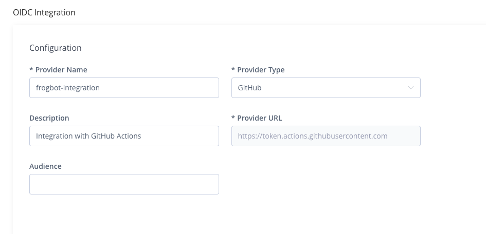
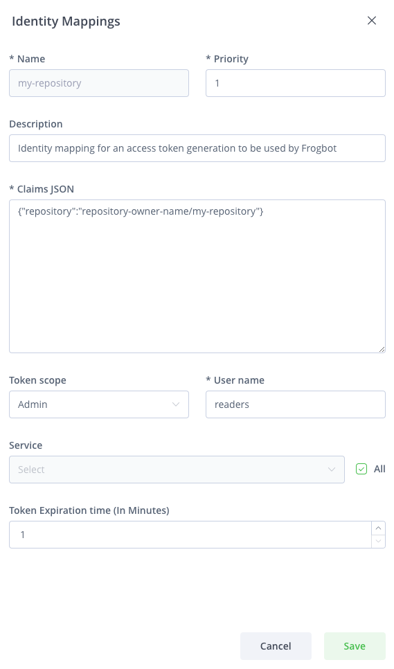

# OIDC Authentication

## **General**

The sensitive connection details, such as the access token used by JFrog Frogbot, can be automatically generated by the action instead of storing it as a secret in GitHub. This is made possible by leveraging the OpenID-Connect (OIDC) protocol. This protocol can authenticate the workflow issuer and supply a valid access token. Learn more about this integration in [this](https://jfrog.com/blog/secure-access-development-jfrog-github-oidc) blog post. To utilize the OIDC protocol, follow these steps:

## **JFrog Platform configuration**

1. **Configure an OIDC Integration**: This phase sets an integration between GitHub Actions to the JFrog platform.
   1. Navigate to the Administration tab In the JFrog Platform UI
   2. Click `General` | `Manage Integrations`
   3. Click `New Integration` | `OpenID Connect`:\
      
   4. Configure the OIDC integration:\
      


The 'Provider Name' value should be used as the 'oidc-provider-name' input in Workflow Configuration step 2 below.

The 'Audience' field does NOT represent the 'aud' claim that can be added to identity-mapping configured in the 'Claims JSON' (shown below). Only claims that are included in the 'Claims Json' created during step 2 will be validated.


2.  **Configure an identity mapping**: This phase sets an integration between a particular GitHub repository to the JFrog platform.

    An identity mapping is a configuration object utilized by the JFrog Platform to associate incoming OIDC claims with particular selected fields. These fields might include `repository`, `actor`, `workflow`, and others. To configure the identity mapping, click on the identity mapping created in section 1 and then click on `Add Identity Mapping`. In the 'priority' field insert the value '1' and fill in the rest of the required fields:\
    

    You have the flexibility to define any valid list of claims required for request authentication. You can check a list of the possible claims [here](https://docs.github.com/en/actions/deployment/security-hardening-your-deployments/about-security-hardening-with-openid-connect#understanding-the-oidc-token). Example Claims JSON:

    ```json
    {
        "repository": "repository-owner/my-repository"
    }
    ```

## Workflow configuration

1.  **Set required permissions**: In the course of the protocol's execution, it's imperative to acquire a JSON Web Token (JWT) from GitHub's OIDC provider. To request this token, it's essential to configure the specified permission in the workflow file:

    ```yml
    permissions:
        id-token: write
    ```
2. **Pass the 'oidc-provider-name' input to the Action (Required)**: The 'oidc-provider-name' parameter designates the OIDC configuration whose one of its identity mapping should align with the generated JWT claims. This input needs to align with the 'Provider Name' value established within the OIDC configuration in the JFrog Platform.
3. **Pass the 'oidc-audience' input to the Action (Optional)**: The 'oidc-audience' input defines the intended recipients of an ID token (JWT), ensuring access is restricted to authorized recipients for the JFrog Platform. By default, it contains the URL of the GitHub repository owner. It enforces a condition, allowing only workflows within the designated repository/organization to request an access token. Read more about it [here](https://docs.github.com/en/actions/deployment/security-hardening-your-deployments/about-security-hardening-with-openid-connect#customizing-the-audience-value).

## Example for OpenID Connect Usage

```
- uses: jfrog/frogbot@v2
  env:
      JF_URL: ${{ vars.JF_URL }}
      JF_GIT_TOKEN: ${{ secrets.GITHUB_TOKEN }}
  with:
      oidc-provider-name: frogbot-integration
```

## **Troubleshooting**&#x20;

### Scan failures due to token expiration&#x20;

When using OIDC integration, you might encounter failures in Xray scans or JFrog Advanced Security scans due to token expiration. If this occurs, try extending the 'Token Expiration Time' in the 'Identity Mapping Configuration' phase to ensure the token remains valid until all scanners are triggered, which may vary depending on the project's size.
