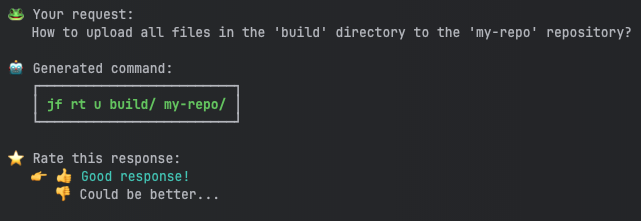

# JFrog CLI AI command assistant

## Overview

The JFrog CLI AI Command Assistant streamlines your workflow by turning natural language inputs into JFrog CLI commands.

Simply describe your desired actions, and the assistant generates commands with all necessary parameters, whether you're uploading artifacts, managing repositories, scanning your code or performing other actions using the JFrog CLI.

Each query is treated individually, and while the interface allows you to refine requests, it doesn’t maintain a chat history.

This tool helps users access the full power of JFrog CLI without needing to remember specific syntax, ensuring efficiency and accuracy.


 Note, This is the first version of JFrog CLI AI, hence it is limited only to Artifactory and Xray commands.


## How to Use the JFrog CLI AI Command Assistant

To use the JFrog CLI AI Command Assistant, follow these simple steps:

### 1. Open your terminal
Ensure that you are in a terminal session where JFrog CLI is installed and configured.

### 2. Supported Version Validation
This feature is available starting from CLI version 2.68 and above. To validate your version, run:

`jf --version`

### 3. Enter the command
Type the following command to initiate the AI assistant:

`jf how`

### 4. Provide your request
After entering the command, you will see a prompt:

**Your request:**

Describe in natural language what you would like the JFrog CLI to do. The AI assistant will generate the exact CLI command needed.

For example, you might type:

`Your request:  How to upload all files in the 'build' directory to the 'my-repo' repository?`

### 5. Receive the generated command
The AI assistant will process your request and output the corresponding JFrog CLI command, including all necessary parameters.  
For the example above, it will generate:

`jf rt u build/ my-repo/`

### 6. Execute or modify
You can now copy the generated command and run it in your terminal.

If needed, you can refine your request and try again.

## FAQ

  
How does JFrog CLI AI Command Assistant work?

When you make a request using the JFrog CLI AI Command Assistant, your input is sent to a model that generates the appropriate JFrog CLI command. This model has been fine-tuned to produce accurate responses based on various inputs. The fine-tuned model is hosted on Azure OpenAI.

    
On what data is the model trained?

The model was trained using a dataset built from two primary sources:
- **JFrog CLI Public Documentation**: This includes detailed information and examples from JFrog’s publicly available resources.
- **Internal Questions and Answers dataset**: The dataset also incorporates internally created questions and answers, which help to refine the model’s ability to provide precise and relevant commands.

    
Does JFrog send customer data to OpenAI’s platform to train its services?

The data you submit and the responses you receive via JFrog CLI AI are not used to fine-tune or improve our model or services. Each data request is sent to Azure OpenAI individually, over an SSL encrypted service, to process and send back to JFrog.

    
Are you saving my inputs and outputs?

No, JFrog does not save users' input and output data.

    
Are you using my inputs and outputs to train the JFrog CLI AI model?

No, JFrog does not use your inputs and outputs to train the model.

    
Does JFrog use my data to serve other customers?

No, JFrog does not use your data to train the model or serve other customers.

