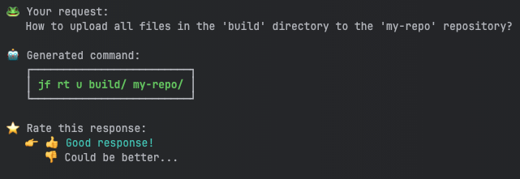

# CLI AI Assistant

**ONLY ACTIVE JFROG CUSTOMERS ARE AUTHORIZED TO USE THE JFROG AI ASSISTANT. ALL OTHER USES ARE PROHIBITED.**

## Overview

The JFrog CLI AI Command Assistant streamlines your workflow by turning natural language inputs into JFrog CLI commands. Describe your desired actions, and the assistant generates commands with all necessary parameters, whether you are uploading artifacts, managing repositories, scanning your code, or performing other actions using the JFrog CLI.

Each query is treated individually, and while the interface allows you to refine requests, it does not maintain a chat history. This tool helps you access the full power of JFrog CLI without needing to remember specific syntax, ensuring efficiency and accuracy.


**Note:** This is the first version of JFrog CLI AI; therefore, it is limited only to Artifactory and Xray commands.




## How to Use the JFrog CLI AI Command Assistant

To use the JFrog CLI AI Command Assistant:

1. Open your terminal. Your command prompt is displayed.
2.  Verify that your CLI version is 2.69 or higher by running the following command:

    ```
    jf --version
    ```
3.  Type the following command to initiate the AI assistant:

    ```
    jf how
    ```
4.  Provide your request when you see the prompt. Describe in natural language what you would like the JFrog CLI to do. For example:

    ```
    Your request: How to upload all files in the 'build' directory to the 'my-repo' repository?
    ```
5.  Receive the generated command. The AI assistant processes your request and outputs the corresponding JFrog CLI command. For the example above, it generates:

    ```
    jf rt u build/ my-repo/
    ```
6. Execute or modify the command. Copy the generated command and run it in your terminal. If needed, you can refine your request and try again.


## FAQ

<details>

<summary>How does JFrog CLI AI Command Assistant work?</summary>

When you make a request, your input is sent to a fine-tuned model hosted on Azure OpenAI, which generates the appropriate JFrog CLI command.

</details>

<details>

<summary>On what data is the model trained?</summary>

The model was trained using a dataset built from two primary sources:

* JFrog CLI Public Documentation: Includes detailed information and examples from JFrog’s publicly available resources.
* Internal Dataset: Incorporates internally created questions and answers to refine the model’s ability to provide precise commands.

</details>

<details>

<summary>Does JFrog send customer data to OpenAI’s platform to train its services?</summary>

No. The data you submit and the responses you receive are not used to fine-tune or improve our model or services. Each request is sent to Azure OpenAI individually over an SSL-encrypted service to be processed.

</details>

<details>

<summary>Are you saving my inputs and outputs?</summary>

No, JFrog does not save your input and output data.

</details>

<details>

<summary>Are you using my inputs and outputs to train the JFrog CLI AI model?</summary>

No, JFrog does not use your inputs and outputs to train the model.

</details>

<details>

<summary>Does JFrog use my data to serve other customers?</summary>

No, JFrog does not use your data to train the model or serve other customers.

</details>
